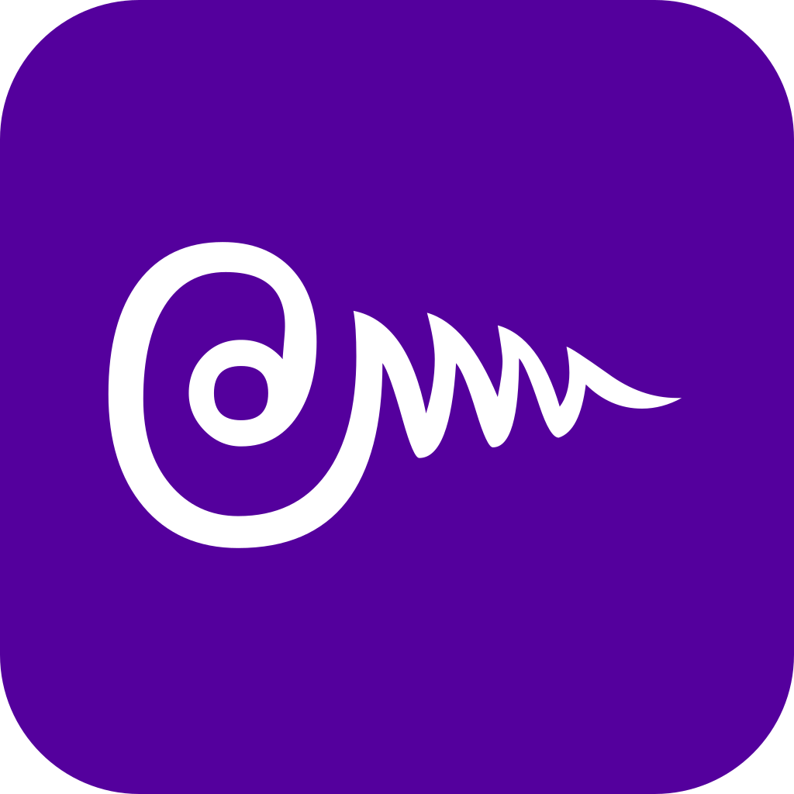

# Thailpha

Thai alphabet web-application

<!-- START doctoc generated TOC please keep comment here to allow auto update -->
<!-- DON'T EDIT THIS SECTION, INSTEAD RE-RUN doctoc TO UPDATE -->

- [about](#about)
- [website](#website)
- [sources & references](#sources--references)
- [about transcription from Thai to latin char](#about-transcription-from-thai-to-latin-char)
- [developers](#developers)

<!-- END doctoc generated TOC please keep comment here to allow auto update -->

## about

- all consonants, vowels & numbers
- provides common informations on each letter 
- provides a “similar list” which reference all graphically similar letters
- searchable
- offline support

## website

[https://thailpha-3e7f6.firebaseapp.com/](https://thailpha-3e7f6.firebaseapp.com/)

## sources & references

- [thai-language.com](http://thai-language.com)
- [wikipedia](https://en.wikipedia.org/wiki/Thai_alphabet)
- [omniglot](http://www.omniglot.com/writing/thai.htm)
- [thaialphabet](https://www.thaialphabet.net)
- icons from [Google Material Icon](https://material.io/icons)
- Thai font [TH Sarabun New](http://www.f0nt.com/release/th-sarabun-new/)

## about transcription from Thai to latin char

quoting [thai-language.com](http://www.thai-language.com/ref/phonemic-transcription)

> There is no standardized romanization scheme for Thai, and many different schemes are in use by different texts and websites.

this apply to this webapp.

## developers

see [README_DEV.md](/README_DEV.md)
